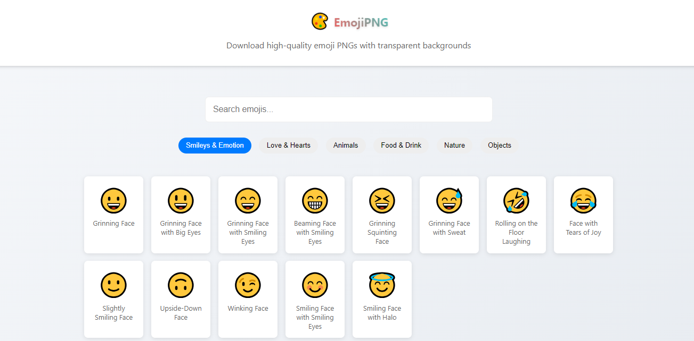

# EmojiPNG - Emoji Download Tool 🎨

EmojiPNG is a modern web application that allows users to easily download high-quality PNG versions of emojis with transparent backgrounds. Perfect for designers, developers, and content creators who need clean emoji assets.

## 🌟 Features

- **High-Quality Downloads**: Get emojis in 512x512 resolution with transparent backgrounds
- **Categorized Browser**: Browse emojis by category (Smileys, Hearts, Animals, etc.)
- **Smart Search**: Search emojis by name or tags
- **Preview Mode**: Preview emojis before downloading
- **Clean UI**: Modern, responsive interface
- **Instant Download**: One-click PNG downloads

## 🚀 Live Demo

Check out the live application: [EmojiPNG Live Demo](https://emoji-png.vercel.app)

## 💻 Technologies Used

- React.js
- HTML Canvas for PNG generation
- CSS3 with Flexbox/Grid
- Modern JavaScript (ES6+)

## 🛠️ Installation

1. Clone the repository:

## 🎯 Key Features Explained

### PNG Generation
- High-resolution output (512x512)
- Transparent background
- Automatic cropping with padding
- Optimized file size

### Emoji Categories
- Smileys & Emotion
- Love & Hearts
- Animals
- Food & Drink
- Nature
- Objects

### Search Functionality
- Real-time filtering
- Search by emoji name
- Search by tags
- Category-based filtering

## 🤝 Contributing

Contributions are welcome! Please feel free to submit a Pull Request.

1. Fork the project
2. Create your feature branch (`git checkout -b feature/AmazingFeature`)
3. Commit your changes (`git commit -m 'Add some AmazingFeature'`)
4. Push to the branch (`git push origin feature/AmazingFeature`)
5. Open a Pull Request

## 📝 License

This project is licensed under the MIT License - see the [LICENSE](LICENSE) file for details.

## 👏 Acknowledgments

- Emoji designs from major platforms
- React.js community
- All contributors and users

## 📧 Contact

Akshay Borse - [@akshayyborse](https://twitter.com/akshayyborse)

Project Link: [https://github.com/akshayyborse/emoji](https://github.com/akshayyborse/emoji)

---

Made with ❤️ by [Akshay Borse]

